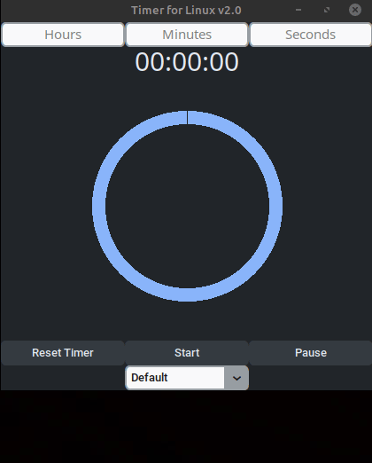

# Timer for Linux, in Python
*with Pygame and with CustomTkinter*

I made this timer app because the options I had on Linux weren't as comfortable to use and I got tired of using a pomodoro timer on my web browser. I tried to make it similar to the Windows 11 timer app (More updates to come!!)

## Requirements:
- Python 3.13.5
- CustomTKinter 6.0.0
- PyGame 2.6.1

## Features:

1. Well it's a timer, what else can you ask?

2. It's lightweight so you can open various timers at once to count different things

3. It shows the timestamp when the timer finishes so you don't end up wondering if it finished a while ago or just now

# How to run it

Download the latest release for your OS and open it :)
